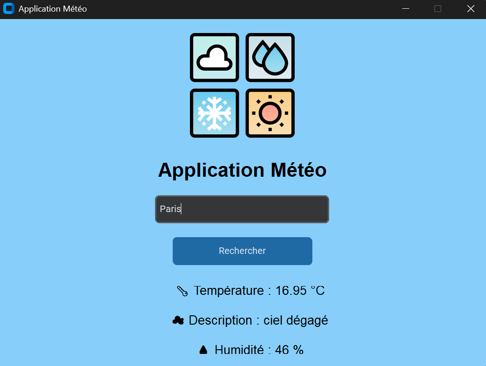

# 🌤 Application Météo Python

Une application météo moderne développée en Python avec CustomTkinter qui permet de consulter la météo en temps réel de n'importe quelle ville dans le monde.

## 🚀 Fonctionnalités

- Recherche météo par ville
- Température en temps réel
- Description météo
- Taux d'humidité
- Interface moderne avec CustomTkinter
- Données récupérées avec l'API OpenWeatherMap

## 🛠 Technologies utilisées

- Python
- CustomTkinter
- Requests
- Pillow (PIL)
- OpenWeatherMap API

## 📦 Installation

1. Cloner le projet

```bash
git clone https://github.com/SamiraK-yeray/Application_meteo.git
```

2. Installer les dépendances

```bash
pip install customtkinter requests pillow
```

3. Lancer le programme

```bash
python main.py
```

🔑 API

Créer une clé API gratuite sur :
https://openweathermap.org/api

📷 Aperçu



👨‍💻 Auteur

Développé par Samira


